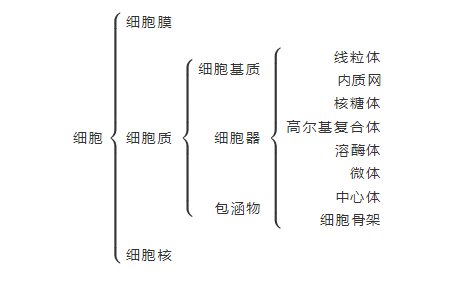
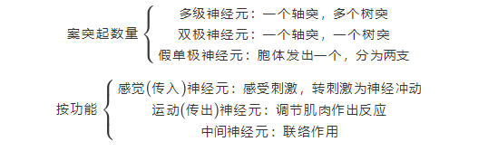

# 基本结构

1. [掌握细胞的结构和功能](#细胞)
2. [了解主要的细胞器的功能](#细胞器)
3. [掌握常用的解剖学术语](#解剖学姿势)

## 细胞

> 定义：细胞是人体形态结构和功能的**基本**单位

#### 细胞基本结构

#### 细胞核

> 细胞核是**遗传物质**的主要存在部位，大多数生物体细胞只有**一个**细胞核，**成熟**的红细胞**没有**细胞核。

##### 染色质与染色体

> 化学组成主要是**脱氧核糖核酸** （**DNA**）和蛋白质
>
> 染色体数目：恒定 46条，23对称双倍体。常染色体：22对，性染色体1对。
>
> 成熟的生殖细胞23条，不成对，称单倍体。
>
> 性染色体：xy为男性，xx为女性

#### 细胞器

> 线粒体：能量工厂，发电站，细胞供能
>
> 核糖体：合成蛋白质
>
> 高尔基复合体：细胞加工厂
>
> 溶酶体：细胞消化器，分解衰老细胞器和异物
>
> 中心体：细胞分裂推动器

## 解剖学姿势

> 身体立直、两眼平视、上肢下垂、掌心向前、下肢并拢、足尖向前

#### 方位术语

> 矢状面：内侧vs外侧
>
> 冠状面：前vs后
>
> 水平面：上vs下

# 基本组织

1. [掌握被覆上皮的分类、分布、特点、了解腺上皮和腺、上皮的特殊结构](#1上皮组织)
2. [掌握结缔组织的分类，疏松结缔组织的组成及功能；理解致密结缔组织、脂肪组织和网状组织的组成及功能；了解软骨组织和软骨](#2缔结组织)
3. [理解及组织的分类，了解骨骼肌、心肌的结构特点](#3肌组织)
4. [掌握突触；理解神经元结构、分类；了解神经胶质细胞、神经末梢的分类及功能](#4神经组织)
5. [了解皮肤的组织结构和附属器](#5皮肤结构)

> 形成：在胚胎发育时期形成的。
>
> 组成：有一些形态相似、功能相近的**细胞**和**细胞外基质**所组成
>
> 分类：上皮组织、肌肉组织、结缔组织、神经组织

### 1.上皮组织

#### 被覆上皮

> 特点：
>
> 1. 细胞多，细胞间质少
> 2. 上皮细胞**有极性**
> 3. 上皮组织**无血管**
> 4. 感觉神经末梢丰富

<table>
   <tr>
      <td></td>
      <td></td>
      <td>分类</td>
      <td>形态结构和特点</td>
      <td>分布</td>
      <td>功能</td>
   </tr>
   <tr>
      <td rowspan="6">被覆上皮</td>
      <td rowspan="4">单层上皮</td>
      <td>单层扁平上皮</td>
      <td>有一层扁平细胞构成，边缘锯齿状，和椭圆形、位于中央</td>
       <td>心、血管、淋巴管<strong>内表面(内皮)</strong>；胸膜、腹膜和心包膜表面</td>
      <td>减少器官活动时互相摩擦</td>
   </tr>
   <tr>
      <td>单层立方上皮</td>
      <td>立方形，核圆形、位于中央</td>
       <td>小叶间胆管、<strong>肾小管</strong>、甲状腺滤泡等处</td>
      <td>分泌和吸收</td>
   </tr>
   <tr>
      <td>单层柱状上皮</td>
      <td>棱柱状，和椭圆形、位于基底部</td>
       <td><strong>胃、肠、胆囊、子宫</strong></td>
      <td>吸收、分泌、保护</td>
   </tr>
   <tr>
      <td>假复层纤毛柱状上皮</td>
      <td>基地面都附着于基膜上</td>
       <td><strong>呼吸道内部表面</strong></td>
      <td>保护、分泌粘液</td>
   </tr>
   <tr>
      <td rowspan="2">复层上皮</td>
      <td>复层扁平上皮</td>
      <td>浅表层：数层扁平C
中间层：束层多边形C
基底部：一层矮柱状或立方形C</td>
      <td>皮肤表层（角化）；
口腔、会厌声带、食管、肛门、阴道（非角化）</td>
      <td>耐摩擦、阻止异物侵入、损伤后再生修复</td>
   </tr>
   <tr>
      <td>复层移行上皮</td>
      <td>多层细胞，细胞的层数及形态可随器官容积变化而改变</td>
       <td>肾盂、膀胱、<strong>输尿管</strong></td>
      <td>保护、溶纳</td>
   </tr>
</table>

#### 腺上皮和腺

> 有**分泌功能**的**上皮**称**腺上皮**
>
> 以**腺上皮**为主要成分**构成**的器官称**腺**

##### 腺的分类

> 外分泌腺：有导管，分泌物经导管排除
>
> 内分泌腺：无导管，分泌物称**激素**，释放到毛细管或毛细淋巴管，再输送到靶器官或靶细胞

#### 上皮组织的特殊结构

1. 游离面
2. 侧面 （电镜下可见连接结构）
3. 基底面

### 2.结缔组织

> 包含：固有结缔组织、软骨组织、骨组织、血液
>
> 具有支持、链接、营养、保护、修复功能
>
> 特点：无极性，细胞少，间质多，有神经血管
>
> 1. 细胞种类多，细胞数量少，无极性
> 2. 细胞间质多，形态多样
> 3. 不与外界环境直接接触

#### 固有结缔组织

##### 疏松结缔组织

> 特点：基质多、细胞少、纤维稀松
>
> 分布：分布与器官之间，组织之间血管、淋巴管、神经通过出
>
> 功能：连接、支持、营养、防御、保护及修复创伤

 ###### 细胞

> 称纤维C：**主要细胞**；**合成纤维**和**基质**，参与**创伤修复**
>
> 巨噬C：**吞噬异物**病菌等，参与免疫；合成活性物质
>
> 浆C：合成分泌抗体，参与体液免疫
>
> 肥大C：**合成肝素**、**组胺、慢反应物质**，参与抗凝、免疫、**过敏**
>
> 脂肪C：合成、储存脂肪

###### 细胞间质

> 纤维
>
> > 胶原纤维：又叫白纤维，胶原原纤维组成，韧性好，弹性差
> >
> > 弹性纤维：又叫黄纤维，弹性好，韧性差
> >
> > 网状纤维：又叫嗜银纤维，无弹性，有韧性
>
> 基质：无定形胶状物，主要成分蛋白多糖和水，有组织液 

##### 致密结缔组织

> 组成：纤维多（胶原纤维和弹性纤维），细胞和基质少
>
> 功能：连接、支持
>
> 主要细胞：成纤维C

##### 脂肪组织

> 组成：大量脂肪C聚集而成。常由疏松结缔组织分隔。
>
> 功能：储存能量、支持、保温等

##### 网状组织

> 组成：网状纤维、网状细胞和基质构成
>
> 功能：为血细胞、淋巴细胞提供适宜环境

#### 软骨组织和软骨

软骨=软骨组织+软骨膜

##### 软骨

> 软骨组织=软骨细胞+细胞间质（纤维和基质）

1. 软骨细胞：**核小而圆**，**1-2个核仁**，功能：分泌软骨基质
2. 纤维：包埋于基质忠，主要有胶原纤维和弹性纤维
3. 软骨基质：呈凝胶状，主要为粘蛋白和水，有一定弹性和硬度

软骨分类

| 透明软骨 | 软骨细胞多，胶原纤维少 | 肋软骨、关节软骨、呼吸道软骨 |
| :------: | :--------------------: | :--------------------------: |
| 弹性软骨 |  大量弹性纤维交织成网  |        分布耳廓、会厌        |
| 纤维软骨 | 大量胶原纤维束平行排列 | 分布椎间盘、耻骨联合、关节盘 |

##### 骨

> 骨是人体内**最坚硬**的器官
>
> 功能：人体的支架，钙、磷的储存库，**造血**
>
> 骨组织=骨细胞+钙化的细胞间质
>
> 是人体最大的**钙库**

### 3.肌组织

#### 骨骼肌（随意肌）

> **附着在骨骼**上
>
> 由肌细胞（肌纤维）和疏松结缔组织构成
>
> 骨骼肌纤维呈细长圆柱状，多个细胞核位于细胞周边
>
> 肌原纤维由粗、细肌丝构成。肌丝由蛋白质构成
>
> ***肌节***是骨骼肌细胞结构和功能***单位***
>
> 属于***横纹肌***和随意肌

#### 心肌（不随意肌）

> 心肌纤维短圆柱状，有分支
>
> 1-2个椭圆形细胞核位于中央
>
> ***有横纹***但不明显
>
> ***有闰盘***

#### 平滑肌（不随意肌）

> 平滑肌纤维***长梭形***
>
> 一个椭圆形细胞核位于中央
>
> ***无横纹***

### 4.神经组织

> 神经细胞（又叫**神经元**，神经系统的**结构和功能基本单位**
>
> > 胞体：细胞膜、细胞核、细胞质：嗜染质（尼氏体，he染成紫蓝色）和神经原纤维（硝酸银染成棕黑色）
> >
> > 突起：轴突（**只有一个**），树突（**一个或多个**）
>
> 胶质细胞
>
> > 中枢神经系统胶质C：星型胶质C（**最大**）、少突胶质C、小胶质C（最小）
> >
> > 周围神经系统胶质

#### 神经元分类

#### 突触

> 概念：神经元与神经元之间、或神经元与效应细胞之间的一中特化的细胞连接，是神经元传递信息的重要结构
>
> 分为电突触和化学突触
>
> 人体内的突触多为化学突触
>
> 结构：突触由突触前部、突触间隙、突触后部构成。突触前部的突触前膜的胞质内有突触小泡，内涵神经递质。 

### 5.皮肤结构

#### 微细结构

##### 表皮

> 角质层
>
> 颗粒层
>
> 棘层
>
> 基底层，又称发生层

##### 真皮

> 乳头层：有**游离神经末梢**
>
> 网状层：有**神经**

#### 附属器

> 毛发
>
> 皮脂腺
>
> 焊线
>
> 指甲

[目录](./../README.md)

[运动系统](./运动系统.md)